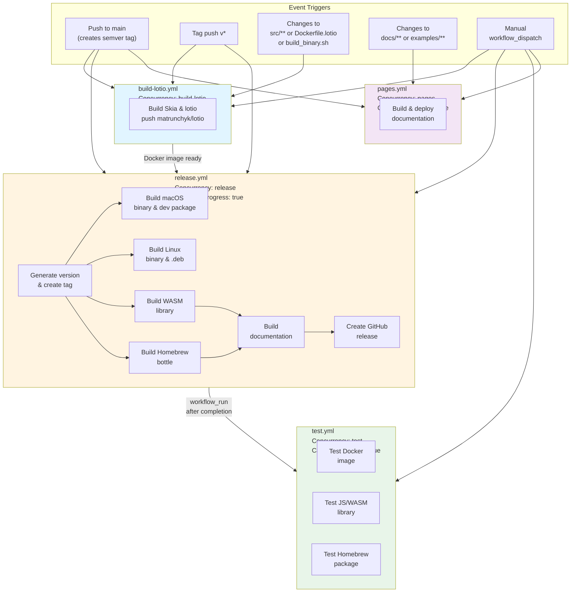

# Lotio

High-performance Lottie animation frame renderer using Skia. Renders animations to PNG frames for video encoding.

## Installation

### Homebrew (Recommended)

```bash
brew tap matrunchyk/lotio
brew install lotio
```

This installs:
- Binary: `lotio`
- Headers: `/opt/homebrew/include/lotio/` (or `/usr/local/include/lotio/`)
- Libraries: `/opt/homebrew/lib/` (Skia static libraries)

### From Source

**Prerequisites (macOS):**
```bash
brew install fontconfig freetype harfbuzz icu4c libpng ninja python@3.11
xcode-select --install
```

**Build:**
```bash
# Build lotio (binary build with zero bundled dependencies)
./scripts/build_binary.sh
```

## Usage

### Command Line

```bash
lotio [--stream] [--debug] [--text-config <config.json>] [--text-padding <0.0-1.0>] [--text-measurement-mode <fast|accurate|pixel-perfect>] <input.json> <output_dir> [fps]
```

**Options:**
- `--stream` - Stream frames to stdout as PNG (for piping to ffmpeg)
- `--debug` - Enable debug output
- `--text-config` - Path to text configuration JSON (for auto-fit and dynamic text values)
- `--text-padding` - Text padding factor (0.0-1.0, default: 0.97 = 3% padding)
- `--text-measurement-mode` - Text measurement mode: `fast` | `accurate` | `pixel-perfect` (default: `accurate`)
- `--version` - Print version information and exit
- `--help, -h` - Show help message
- `fps` - Frames per second for output (default: 25)

**Examples:**
```bash
# Render to PNG frames
lotio animation.json frames/ 30

# Stream to ffmpeg
lotio --stream animation.json - | ffmpeg -f image2pipe -i - output.mp4

# With text configuration
lotio --text-config text_config.json animation.json frames/
```

### Docker (Recommended for Video Output)

**Quick start with automatic video encoding:**
```bash
docker run --rm -v $(pwd):/workspace matrunchyk/lotio-ffmpeg:latest \
  data.json - 30 --text-config text-config.json --output video.mov
```

**Available images:**
- `matrunchyk/lotio-ffmpeg:latest` - lotio + FFmpeg with automatic video encoding (recommended)
- `matrunchyk/lotio:latest` - lotio binary only (for programmatic use)

**Multi-platform support:** Both images support `linux/arm64` and `linux/amd64`.

See [Docker Documentation](docs/docker.html) for detailed usage.

### Browser (WebAssembly)

Install from npm/GitHub Packages:

```bash
npm install @matrunchyk/lotio
```

**Basic Usage:**

```javascript
import Lotio, { FrameType, State, TextMeasurementMode } from '@matrunchyk/lotio';

// Load fonts
const fontResponse = await fetch('./fonts/OpenSans-Bold.ttf');
const fontData = new Uint8Array(await fontResponse.arrayBuffer());

// Load animation
const animationResponse = await fetch('./animation.json');
const animationData = await animationResponse.json();

// Create animation instance
const animation = new Lotio({
  fonts: [{ name: 'OpenSans-Bold', data: fontData }],
  fps: 30,
  animation: animationData,
  textConfig: { /* optional text config */ },
  textPadding: 0.97,  // Optional: text padding factor (default: 0.97)
  textMeasurementMode: TextMeasurementMode.ACCURATE,  // Optional: TextMeasurementMode.FAST | TextMeasurementMode.ACCURATE | TextMeasurementMode.PIXEL_PERFECT
  type: FrameType.PNG,
  wasmPath: './lotio.wasm'
});

// Event handlers (fluent interface)
animation
  .on('error', (error, anim) => {
    console.error('Animation error:', error);
  })
  .on('loaded', (anim) => {
    console.log('Animation loaded');
    anim.start();
  })
  .on('start', (anim) => {
    console.log('Animation started');
  })
  .on('pause', (anim) => {
    console.log('Animation paused');
  })
  .on('stop', (anim) => {
    console.log('Animation stopped');
  })
  .on('end', (anim) => {
    console.log('Animation ended');
  })
  .on('frame', (frameNumber, time, anim) => {
    // Render to canvas
    const canvas = document.getElementById('canvas');
    anim.renderToCanvas(canvas, '#2a2a2a');
  });

// Control methods
animation
  .setFps(60)           // Change FPS
  .seek(10)             // Seek to frame 10
  .start()              // Start playback
  .pause()              // Pause
  .stop();              // Stop and reset

// Getters
const fps = animation.getFps();
const state = animation.getState(); // 'stopped' | 'paused' | 'loaded' | 'error' | 'playing'
const frame = animation.getCurrentFrame();
const info = animation.getAnimationInfo();

// Render current frame to canvas
const canvas = document.getElementById('canvas');
animation.renderToCanvas(canvas, '#ffffff');

// Cleanup
animation.destroy();
```

**Full Example with Canvas:**

```html
<!DOCTYPE html>
<html>
<head>
  <title>Lotio Animation</title>
</head>
<body>
  <canvas id="canvas"></canvas>
  <button id="playBtn">Play</button>
  <button id="pauseBtn">Pause</button>
  <button id="stopBtn">Stop</button>
  
  <script type="module">
    import Lotio from '@matrunchyk/lotio';
    
    let animation;
    
    async function init() {
      // Load font
      const fontRes = await fetch('./fonts/OpenSans-Bold.ttf');
      const fontData = new Uint8Array(await fontRes.arrayBuffer());
      
      // Load animation
      const animRes = await fetch('./animation.json');
      const animData = await animRes.json();
      
      // Create animation
      animation = new Lotio({
        fonts: [{ name: 'OpenSans-Bold', data: fontData }],
        fps: 30,
        animation: animData,
        wasmPath: './lotio.wasm'
      });
      
      const canvas = document.getElementById('canvas');
      
      // Render frames
      animation.on('frame', () => {
        animation.renderToCanvas(canvas);
      });
      
      // Controls
      document.getElementById('playBtn').onclick = () => animation.start();
      document.getElementById('pauseBtn').onclick = () => animation.pause();
      document.getElementById('stopBtn').onclick = () => animation.stop();
    }
    
    init();
  </script>
</body>
</html>
```

## Samples

The `samples/` directory contains example Lottie animations and configurations:

- **`samples/sample1/`** - Basic animation with text configuration
  - `data.json` - Lottie animation file
  - `text-config.json` - Text customization configuration
  - `output/` - Rendered frames (run lotio to generate)

- **`samples/sample2/`** - Animation with external images
  - `data.json` - Lottie animation file with image references
  - `images/` - External image assets referenced by the animation
  - `output/` - Rendered frames (run lotio to generate)

**Try the samples:**
```bash
# Sample 1: Basic animation with text customization
cd samples/sample1
lotio --text-config text-config.json data.json output/ 30

# Sample 2: Animation with external images
cd samples/sample2
lotio data.json output/ 30
```

## Using as a Library

### Headers

Headers are installed at `/opt/homebrew/include/lotio/` (or `/usr/local/include/lotio/`):

```cpp
#include <lotio/core/animation_setup.h>
#include <lotio/text/text_processor.h>
#include <lotio/utils/logging.h>
```

### Linking

Link with Skia libraries:

```bash
g++ -I/opt/homebrew/include -L/opt/homebrew/lib \
    -llotio -lskottie -lskia -lskparagraph -lsksg -lskshaper \
    -lskunicode_icu -lskunicode_core -lskresources -ljsonreader \
    your_app.cpp -o your_app
```

Or use pkg-config (recommended):

```bash
g++ $(pkg-config --cflags --libs lotio) your_app.cpp -o your_app
```

### Using Skia Directly

The lotio package includes Skia headers and libraries, so you can use Skia features directly in your code:

```cpp
// Use Skia directly
#include <skia/core/SkCanvas.h>
#include <skia/core/SkSurface.h>
#include <skia/modules/skottie/include/Skottie.h>

// Use lotio
#include <lotio/core/animation_setup.h>

int main() {
    // Use Skia API directly
    SkImageInfo info = SkImageInfo::MakeN32(800, 600, kOpaque_SkAlphaType);
    auto surface = SkSurfaces::Raster(info);
    
    // Use lotio functions
    AnimationSetupResult result = setupAndCreateAnimation("input.json", "");
    
    return 0;
}
```

Compile with:
```bash
g++ $(pkg-config --cflags --libs lotio) your_app.cpp -o your_app
```

The pkg-config file includes all necessary include paths:
- `-I${includedir}` - Lotio headers
- `-I${includedir}/skia` - Skia core headers
- `-I${includedir}/skia/gen` - Skia generated headers

## CI/CD Pipeline

The project uses GitHub Actions workflows for automated building, testing, and deployment:



### Workflow Descriptions

**build-lotio.yml** - Builds and publishes `matrunchyk/lotio` Docker image
- **Purpose**: Create lotio binary Docker image using pre-built Skia base image
- **Triggers**: Main branch push, tag pushes, source code changes, Dockerfile.lotio changes, build_binary.sh changes, manual dispatch
- **Logic**: Uses `matrunchyk/skia:latest` as base image (Skia pre-built), only compiles lotio source
- **Build chain**: `Dockerfile.skia` → `Dockerfile.lotio` (uses pre-built Skia)
- **Concurrency**: Single instance per workflow (cancels in-progress runs when new one starts)
- **Output**: `matrunchyk/lotio:latest` and `matrunchyk/lotio:v1.2.3` (multi-platform: arm64, amd64)
- **Architecture tags**: Also creates `-arm64` and `-amd64` tags for clarity

**release.yml** - Builds all release artifacts and creates GitHub release
- **Purpose**: Build and package all distribution formats (binaries, WASM, Homebrew, docs)
- **Triggers**: Push to main (creates semver tag automatically), tag pushes (v*), manual dispatch
- **Logic**: 
  - Generates semver version from tag or creates new tag on main push
  - Builds Skia from scratch using `build_binary.sh` (zero bundled dependencies, fast build)
  - Builds in parallel: macOS, Linux, WASM, Homebrew
  - Injects version into all artifacts
- **Concurrency**: Single instance per workflow (cancels in-progress runs when new one starts)
- **Output**: macOS dev package, Linux .deb, WASM package, Homebrew bottle, GitHub release

**test.yml** - Integration tests for all built artifacts
- **Purpose**: Validate that all release artifacts work correctly
- **Triggers**: After `release.yml` completes successfully, manual dispatch
- **Tests**:
  - Docker image: `--help`, `--version`, library functionality, video generation with `--debug`
  - JS/WASM library: Load, API functions, frame rendering
  - Homebrew package: Installation, `--help`, `--version`, basic functionality
- **Concurrency**: Single instance per workflow (cancels in-progress runs when new one starts)

**pages.yml** - Builds and deploys documentation to GitHub Pages
- **Purpose**: Generate and deploy documentation with version injection
- **Triggers**: Changes to docs, examples, or build scripts; manual dispatch
- **Logic**: Installs lotio npm package, injects version from git tag
- **Concurrency**: Single instance per workflow (does not cancel in-progress runs)
- **Output**: Deployed to GitHub Pages

## Project Structure

```
src/
├── core/          # Core functionality (argument parsing, animation setup, rendering)
├── text/          # Text processing (configuration, font handling, sizing)
└── utils/         # Utilities (logging, string utils, crash handling)
```

## IDE Setup

The project includes IDE configuration for Cursor/VS Code:
- `.vscode/c_cpp_properties.json` - C/C++ extension settings
- `.clangd` - clangd language server settings

Reload Cursor/VS Code after cloning: `Cmd+Shift+P` → "Reload Window"

## Troubleshooting

**Skia build fails:**
- Ensure all dependencies are installed
- Check sufficient disk space (Skia build is large)
- Review error messages in `scripts/build_binary.sh` output

**Linker errors:**
- Verify Skia libraries exist in `third_party/skia/skia/out/Release/`
- Check library paths in build script

**IDE include errors:**
- Reload Cursor/VS Code
- Verify `.vscode/c_cpp_properties.json` has correct paths

## License

See individual component licenses:
- Skia: `third_party/skia/skia/LICENSE`
